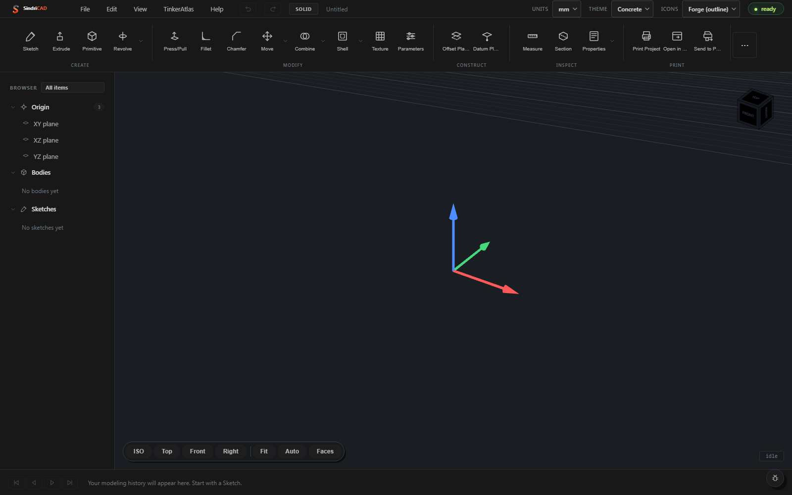
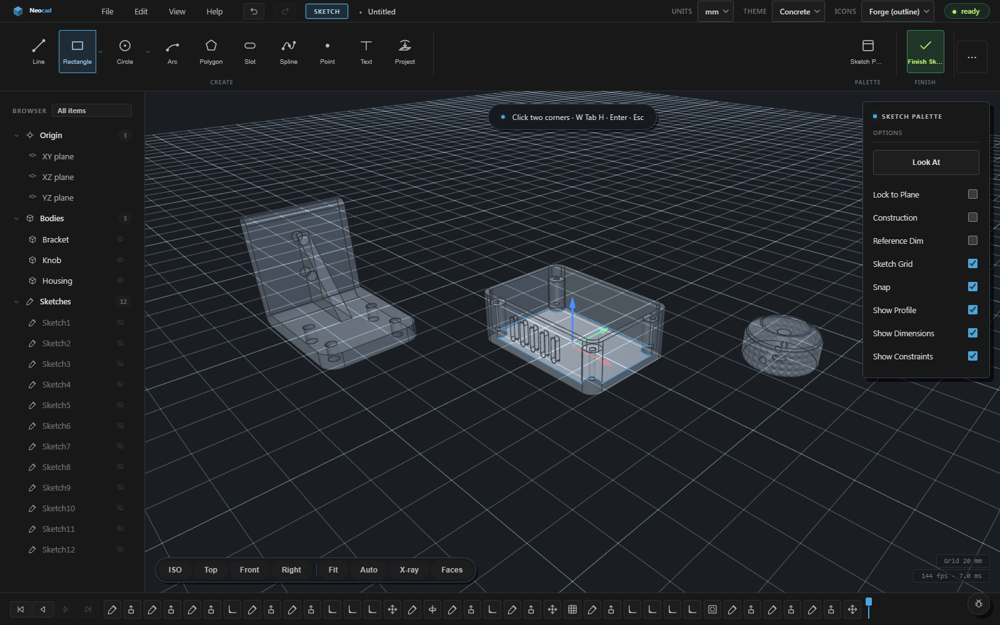
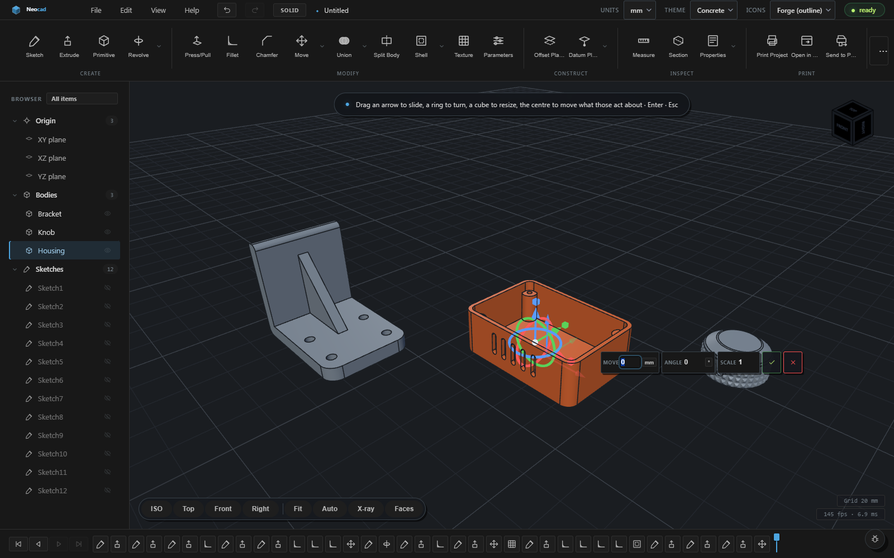
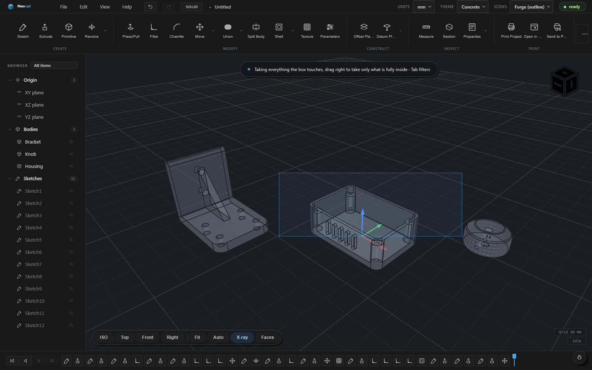

# Neocad

A fork of SindriCAD with some tweaks to the workflow.

A parametric solid modeller: sketch, extrude, fillet, chamfer, and export
STEP/STL/3MF. The UI is Vue 3 + Three.js running in a Tauri window; all geometry
lives in a Python sidecar on build123d / OpenCASCADE, which the app talks to over
a localhost WebSocket.

## Discression
This project heavily or exclusively uses AI to generate code and tests.
do NOT expect this software to be enterprise grade but it does allow very fast itteration.
you may use AI for feature requests or even forking and creating your own.
this code open to the public and free forever.

human input is made for decisions, guiding and real usage by me.
the goal is it to make this a personalized version of a CAD with features I like and would love to have.


<p align="center">
  
</p>

## What it looks like


<p align="center">
  
</p>

<p align="center">
  
</p>


<p align="center">
  
</p>

## Install

Prebuilt installers for Windows, macOS (Apple Silicon) and Linux are on the
[beta release](https://github.com/Paraxdev/neocad/releases/tag/beta), rebuilt
from `main` on every green build. These builds do not update themselves, so come
back to that page for a newer one.

On Windows there is also a **portable zip** (`…_x64_portable.zip`). Unzip it
anywhere and run `Neocad.exe`: no installer, no admin rights, and several builds
can sit side by side. It carries the same files the installer lays down,
including the Python geometry engine, so it needs nothing else beyond the
WebView2 runtime that Windows 11 and an up-to-date Windows 10 already have.
Portable means no installer rather than no traces: preferences still live in
your user profile.

The builds are **not code signed**, so each OS says so in its own way:

- **Windows** — SmartScreen shows "Windows protected your PC". Choose **More
  info**, then **Run anyway**. The portable build says it too, on first run.
- **macOS** — Gatekeeper may report the app as damaged. It is not; that is what
  an unsigned app looks like to a current macOS. Clear the quarantine flag once,
  after moving it to Applications:
  ```bash
  xattr -dr com.apple.quarantine /Applications/Neocad.app
  ```
- **Linux** — the AppImage needs `chmod +x` and nothing else. The `.deb` and
  `.rpm` install normally.

## Build

Needs [Node](https://nodejs.org), [Rust](https://rustup.rs) (for the Tauri
shell), and [uv](https://docs.astral.sh/uv) (which fetches Python for you).

```bash
git clone https://github.com/Paraxdev/neocad.git
cd neocad
npm install
(cd sidecar && uv sync)
```

Then:

```bash
npm run tauri dev      # run it, starts vite and the sidecar for you
npm run tauri build    # package a desktop build
npm test               # vitest
```

### Frontend only

Two terminals, if you are iterating on the UI and don't need a Rust rebuild:

```bash
cd sidecar && uv run python server.py   # ws://127.0.0.1:8765
npm run dev                             # http://localhost:5173
```

The sidecar prints `TOKEN <t>` on its first line and refuses connections without
it, so open `http://localhost:5173/?token=<t>`. Without it the viewport connects,
is refused, and silently never builds anything. A sidecar started this way also
outlives its shell, so kill it by hand or it keeps port 8765.
